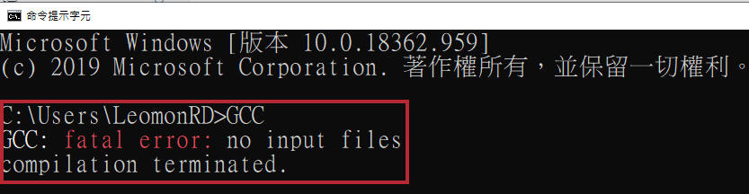

# 1-1 使用方式

## MinGW

使用[MinGW](http://www.mingw.org/)下載點， 若要在Windows下執行GCC，安裝完成後需要設定windows環境變數， 設定方法`由控制台→系統→進階系統設定→進階(Label)→環境變數`。


 於下方系統變數裡找到 path 這個環境變數，再按下面的編輯， 結尾部分加上：

```bash
>記住分號不可省略，若找不到PATH這個變數，可自行新增：

變數名稱 : 
>PATH，變數值 : 

%SystemRoot%\system32;%SystemRoot%;C:\MinGW\bin
```

或是加入下圖紅色框線位置。


重開機使環境變數生效，可以在 cmd 輸入 gcc -v， 如果出現 gcc 的相關資訊表示安裝成功！ 若單純打gcc\(g++\)只會顯示 gcc\(g++\):fatal error :no input files的訊息!!



